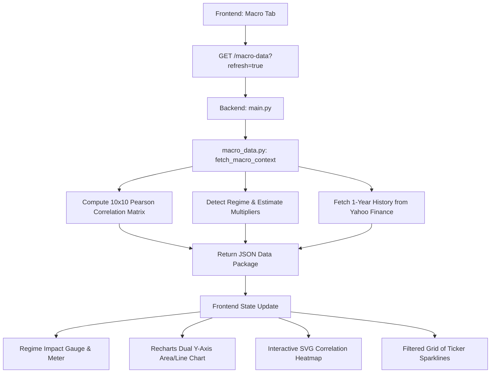

# Macro Dashboard Upgrade Design

## Goal
Evolve the Macroeconomic Dashboard from a basic list of tickers into an institutional-grade, highly interactive, and visually stunning dashboard that directly bridges macroeconomic indicators to our Black-Litterman asset allocation framework.

Key objectives:
1. **Interactive Multi-Timeframe Charting**: Allow filtering the 3M/6M/1Y history dynamically in the frontend, backed by 1-year history fetched from the backend.
2. **Dual-Indicator Overlay / Comparison Mode**: Enable dual Y-axis comparison of two indicators (e.g. SPY vs. VIX, or Gold vs. US10Y).
3. **Macro Correlation Matrix Heatmap**: Compute a Pearson correlation matrix for key macro indicators on the backend and render it as an interactive heatmap.
4. **Regime Allocation Impact Panel**: Visualize the current market regime, VIX level, and the risk aversion multiplier ($\lambda$ multiplier) that dynamically adjusts the Black-Litterman optimization.
5. **Categorized Filters and Alerts**: Filter the 20+ tickers by category and show alerts (e.g., VIX spikes, yield curve inversion).

---

## Proposed System Architecture

---

## Detailed Component Specifications

### 1. Backend Upgrades

#### A. Fetching 1-Year History
*   **File**: `backend/app/macro_data.py`
*   Modify `fetch_macro_context()` to change the yfinance period parameter from `period="3mo"` to `period="1y"`.
*   Maintain the output format (`history` list containing dates and values) so it remains backward-compatible with any existing endpoints.

#### B. Correlation Matrix Computation
*   **File**: `backend/app/macro_data.py`
*   Implement `compute_correlation_matrix(indicators_dict)` which:
    1. Selects key indicators representing different asset classes and macro forces: `["SPY", "QQQ", "KOSPI", "VIX", "US10Y", "YIELD_SPREAD", "HYG", "GOLD", "BTC", "USD_KRW"]`.
    2. Builds a dictionary of close price histories aligned by date.
    3. Converts histories to a pandas DataFrame, aligns by date (using forward-fill for missing values), and computes the Pearson correlation matrix `.corr()`.
    4. Formats the matrix output as a dict-of-dicts (or list-of-lists) mapping indicator keys to correlation values.
*   Include the computed matrix as a `correlation_matrix` key in the returned JSON.

#### C. Cache Clearing & Force Refresh Route
*   **File**: `backend/app/main.py`
*   Modify the `/macro-data` endpoint to accept a `refresh: bool = False` query parameter.
*   If `refresh=True` is provided, clear the cached `_last_macro_context` in `app.llm` and trigger a fresh fetch from yfinance, caching the new results.

---

### 2. Frontend Upgrades (`frontend/app/page.tsx`)

#### A. Timeframe & Overlay Charting Engine
*   **Timeframe Toggles**: `1M`, `3M`, `6M`, `1Y` (all-caps, D-DIN display font, wide letter-spacing). On click, filter the indicator's history array locally to only display dates within the selected range.
*   **Comparison Selector**: Add a dropdown list of other tickers to overlay.
*   **Dual Y-Axis Rendering**: If a comparison ticker is selected, render a line chart for the comparison ticker on a secondary Y-axis (`yAxisId="right"`, right-aligned) over the main indicator's area chart.
*   **Visual Aesthetics**:
    *   Main area chart uses a gradient opacity fill (green if 5d/3m change is positive, red if negative).
    *   Secondary comparison line uses a contrasting thin dashed/solid line (e.g. white or light gray) for clear legibility on the dark theme.
    *   Refined Custom Tooltip showing values for both indicators, color-coded, with full names.

#### B. Regime & Allocation Impact Panel
*   Render a glassmorphic dashboard widget showing the current regime.
*   **Visual Scale**: Render a horizontal grid of the 4 regimes: `LOW_VOL`, `NORMAL`, `ELEVATED_RISK`, `CRISIS`. Highlight the current active one with neon colors (Crisis = pulsing red, Elevated = amber, Normal = muted white, Low Vol = emerald green).
*   **Multiplier Metric**: Display the risk-aversion multiplier (`0.9x`, `1.0x`, `1.25x`, `1.6x`) in a large uppercase label. Add an info text explaining how this multiplier penalizes high-volatility assets and shifts optimal allocations toward defensive assets.

#### C. Interactive Correlation Heatmap
*   Render an interactive correlation matrix grid.
*   **Cell Styling**:
    *   Background opacity indicates correlation strength (e.g. `-1.0` is deep red/orange, `0` is neutral dark gray, `+1.0` is deep emerald/cyan).
    *   Hovering over a cell displays the correlation value (e.g., `-0.72`) and highlights the row/column.
    *   Clicking a cell displays a short explainer card (e.g. `"SPY & VIX correlation is -0.72. Negative correlation indicates VIX acts as a hedge; when stocks fall, VIX spikes."`).

#### D. Categorized Ticker Grid & Filters
*   Add a category pill nav bar: `ALL`, `VOLATILITY`, `YIELD CURVE`, `CREDIT`, `EQUITY`, `COMMODITIES/CRYPTO`, `FOREX`.
*   Show warning alert badges on individual cards:
    *   **Inversion Alert**: If `YIELD_SPREAD` is negative.
    *   **Volatility Spike**: If VIX is above 20.
    *   **Crypto Crash/Rally**: If BTC or GOLD has a 5D change exceeding $\pm 10\%$.

---

## Verification Plan

### Automated Verification
1. Run backend unit tests (`pytest backend/tests/`) to verify everything continues to build.
2. Verify `/macro-data` and `/macro-data?refresh=true` endpoints return valid JSON containing 1-year history and the correlation matrix.

### Manual Verification
1. Run the frontend and verify the layout compiles successfully.
2. Select different timeframes (`1M`, `3M`, `6M`, `1Y`) and confirm the chart updates correctly.
3. Select an overlay indicator (e.g., overlay SPY with VIX) and check the dual Y-axis layout and tooltip.
4. Hover and click cells in the Correlation Heatmap, confirming the values and explainers update dynamically.
5. Click "REFRESH DATA" and verify that a fresh network request is fired to the backend and the cache is cleared/reloaded.
