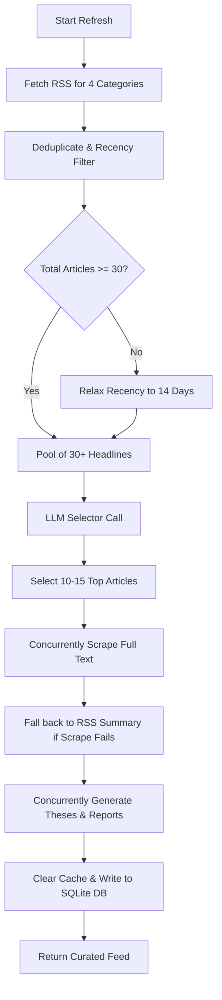

# Market Intelligence Feed Refresh Design

## Goal
Improve the Market Intelligence feed refresh behavior so that:
1. At least 30 fresh news articles are fetched and read from RSS feeds.
2. The LLM selects the top 10-15 most important articles for tactical asset allocation.
3. The selected articles have their full content scraped/read.
4. The selected articles are analyzed into structured theses and curated on the feed.
5. Latency is minimized through parallelized scraping and LLM analysis.

## Proposed System Architecture

### 1. Fetching RSS headlines
- File: [market_intelligence.py](file:///c:/Users/hyunjaekim/Desktop/Etacolla/AI-asset-allocation/backend/app/market_intelligence.py)
- Change `fetch_rss_headlines_for_category` to iterate over all items in the RSS feed instead of slicing to `limit` before checking the publication date recency filter.
- Collect unique articles across all 4 categories (`EQUITY`, `BOND`, `ALTERNATIVE`, `MACRO`).
- Ensure the combined pool has at least 30 articles. If not, retry fetching with a wider recency filter (e.g. `MAX_ARTICLE_AGE_DAYS` set to 14 instead of 7).

### 2. Selection LLM Call
- Implement a new helper function `select_top_articles_with_llm(headlines)` in `market_intelligence.py`.
- Formats all pooled headlines with titles, source, pubDate, category, and description into a prompt.
- Asks the LLM to select the top 10 to 15 articles that are most relevant/consequential for global tactical asset allocation.
- Returns a list of the selected articles.

### 3. Scraping & Deep Analysis
- For the selected 10-15 articles, scrape their full content using `fetch_url_text(url)` in parallel using `asyncio.gather`.
- If scraped content is empty or too short (e.g. paywall/JS block), fallback to the original headline/summary description.
- For each selected article, call the LLM to generate the detailed investment thesis and Bloomberg-style report. We will run these calls in parallel to keep latency low.
- Cache the generated theses as `NEWS` items in the `market_intelligence` table, replacing the old news items.

## Verification Plan

### Automated/Unit Verification
- Run a test script to trigger the feed refresh and verify that:
  - At least 30 articles are fetched/read initially.
  - Exactly 10-15 articles are selected, analyzed, and saved in the DB.
  - The feed returns the correct number of items.

### Manual Verification
- Trigger refresh from the frontend and inspect logs to confirm the correct flow, correct count, and high quality of generated reports.
